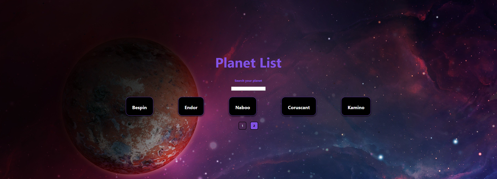
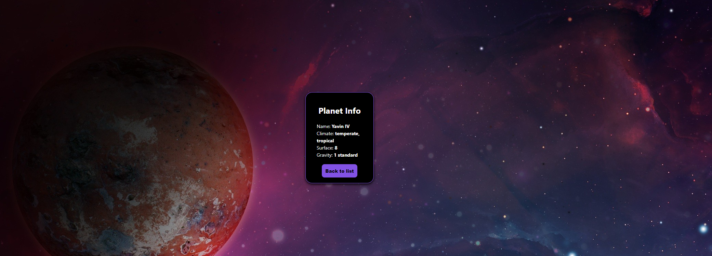

# Planet List 🌍

This project is a list of Star Wars's planets. The objective is show the main planets mentioneds on the movies.

You can search for a specific planet and see the details.





## Getting Started 🔥

First, run the development server:

```bash
npm run dev
# or
yarn dev
```

Open [http://localhost:3000](http://localhost:3000) with your browser to see the result.

## For testing 📄

You can test using:

```bash
yarn test
```

## Technologies 🔨

- React 18
- Nextjs
- TypeScript
- Styled-components
- Jest
- React Testing Library

## Dependencies 🚧

This project calls SWAPI API:

```bash
BaseURL: "https://swapi.dev/api/"
```

## Deploy on Vercel

https://planet-list.vercel.app/
